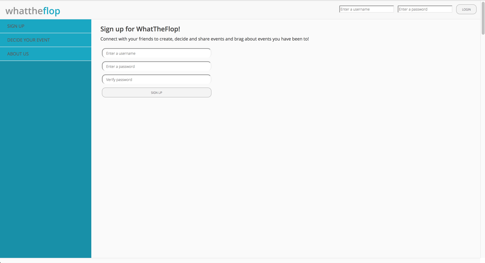
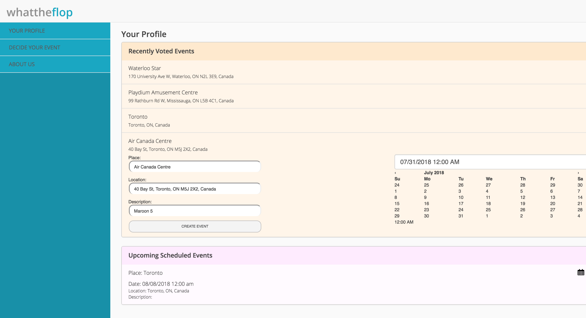
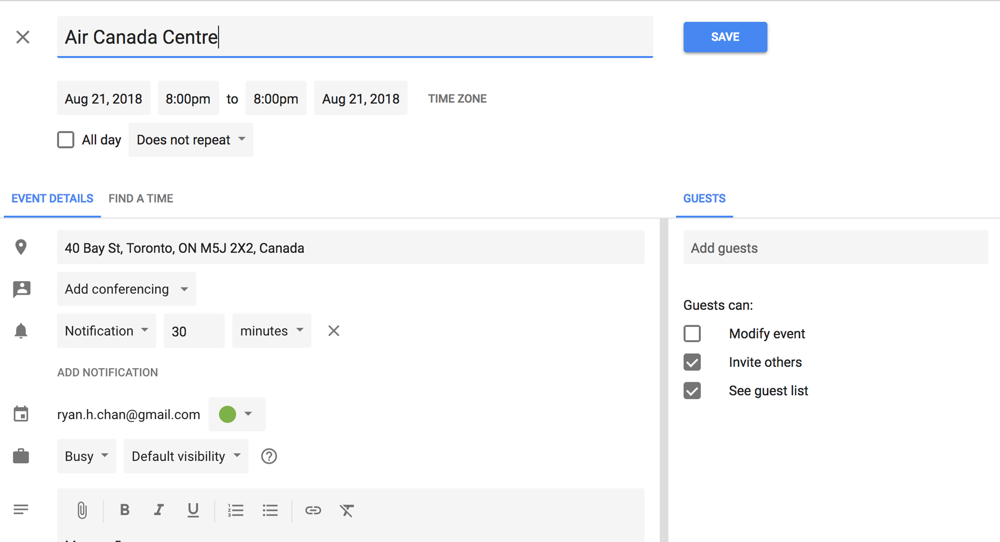
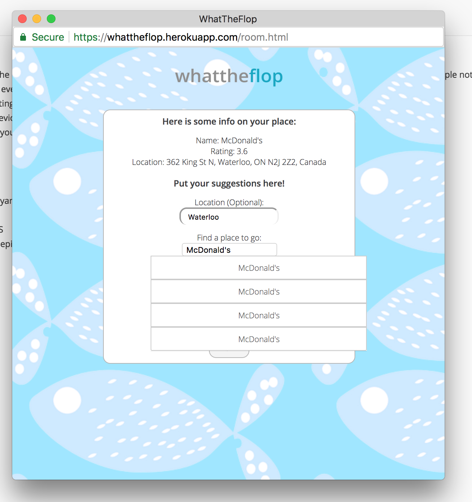

# WhatTheFlop
## About
An event planning web application, originally deployed using SSL Encryption/GUnicorn/Nginx, that uses the Google Calendar and Google Place API to provide a platform for easy event coordinating and scheduling.

This application is developed using: React/Axios for the frontend, Flask/PostgreSQL for the backend, Heroku/GUnicorn/Nginx/SSL Encryption for deployment.

[Demo](https://whattheflop.herokuapp.com/)

## Demo Pictures

